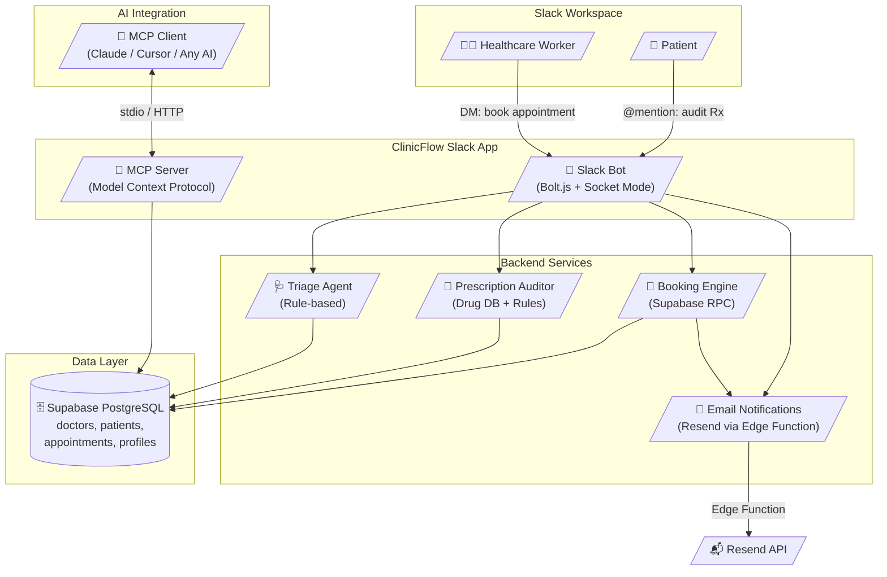
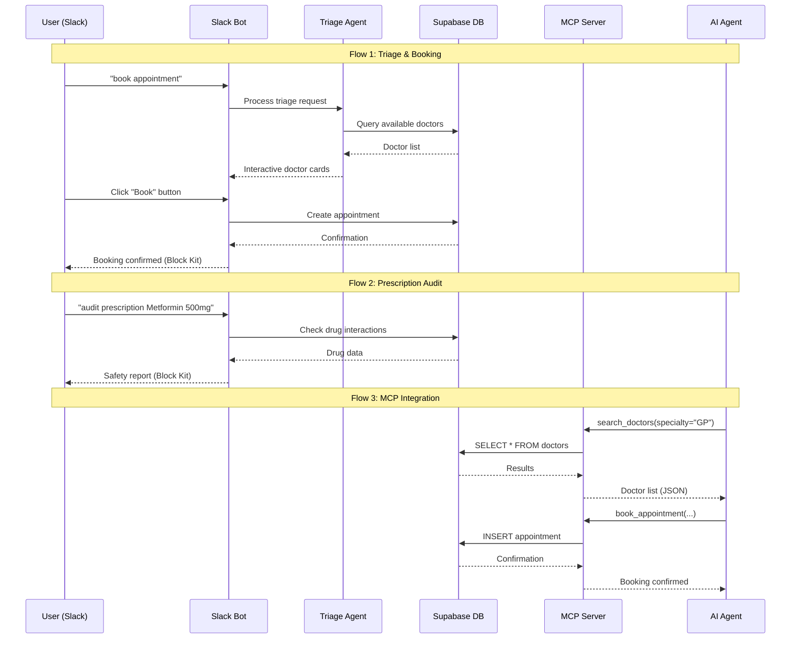

# ClinicFlow — Architecture Diagram

## System Architecture

## Data Flow

## Technology Stack

| Layer | Technology | Purpose |
|-------|-----------|---------|
| Frontend | Slack Block Kit | Rich interactive UI in Slack |
| Bot Runtime | Bolt.js + Socket Mode | Real-time message handling |
| MCP Server | @modelcontextprotocol/sdk | AI agent integration |
| Database | Supabase (PostgreSQL) | Data persistence |
| Email | Resend (via Edge Function) | Notification delivery |
| Hosting | Local (dev) / Render (prod) | Runtime environment |

## MCP Server Tools

| Tool | Description |
|------|------------|
| `search_doctors` | Search available doctors by specialty or name |
| `book_appointment` | Create appointment booking in database |
| `audit_prescription` | Drug interaction and dosage safety check |
| `list_appointments` | List upcoming appointments |
